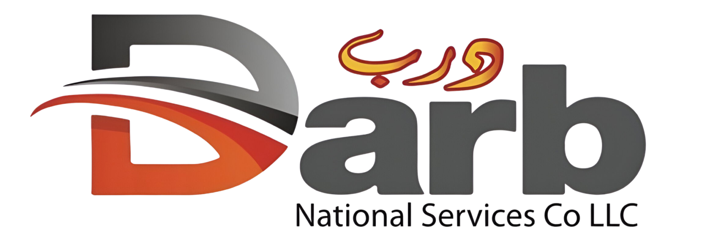

<div align="center">

  

  # درب لخدمات المساعدة على الطريق | DARB Roadside Assistance
  
  **خدمات المساعدة على الطريق في جميع أنحاء سلطنة عُمان على مدار الساعة (24/7)**  
  *Professional 24/7 roadside emergency assistance platform across the Sultanate of Oman.*

  [](https://reactjs.org/)
  [](https://vitejs.dev/)
  [](https://www.typescriptlang.org/)
  [](https://tailwindcss.com/)
  [](https://ui.shadcn.com/)
  [](LICENSE)

</div>

---

## 📖 جدول المحتويات / Table of Contents
- [نبذة عن المشروع / Overview](#-نبذة-عن-المشروع--overview)
- [المميزات الرئيسية / Key Features](#-المميزات-الرئيسية--key-features)
- [الخدمات المتاحة / Available Services](#-الخدمات-المتاحة--available-services)
- [شركاء التأمين / Insurance Partners](#-شركاء-التأمين--insurance-partners)
- [التقنيات المستخدمة / Tech Stack](#-التقنيات-المستخدمة--tech-stack)
- [متطلبات التشغيل والتثبيت / Installation & Setup](#-متطلبات-التشغيل-والتثبيت--installation--setup)
- [هيكل المشروع / Project Structure](#-هيكل-المشروع--project-structure)
- [التواصل والدعم / Emergency Contact](#-التواصل-والدعم--emergency-contact)

---

## 🌟 نبذة عن المشروع / Overview

**درب (DARB)** هي منصة ويب عصرية متطورة مخصصة لتقديم خدمات المساعدة الطارئة للمركبات على مدار 24 ساعة طوال أيام الأسبوع في مختلف محافظات ومناطق سلطنة عُمان. صُممت المنصة لتوفير تجربة استجابة سريعة وسلسة للسائقين مع إمكانية الوصول الفوري لخطوط الطوارئ والربط مع شركات التأمين المعتمدة.

**DARB** is a modern, responsive web application offering 24/7 roadside assistance across Oman. Designed with performance and ease-of-use in mind, it provides motorists with immediate access to rescue services, quick dispatch hotlines, and trusted insurance partnerships.

---

## ✨ المميزات الرئيسية / Key Features

- 🌐 **دعم كامل للغتين (العربية والإنجليزية)** مع توفير اتجاه قراءة ملائم (RTL/LTR).
- 🚨 **اتصال طوارئ فوري بنقرة واحدة** للوصول السريع إلى فرق الدعم الميدانية.
- 🎨 **تصميم عصري وجذاب (Dark Modern Aesthetic)** مدعوم بمؤثرات بصرية وتوهج تفاعلي سلس.
- 📱 **متجاوب بالكامل (Fully Responsive)** لجميع الأجهزة والهواتف الذكية والأجهزة اللوحية.
- 🤝 **ربط مع شركات التأمين الرائدة** في سلطنة عُمان لتسهيل الإجراءات.
- ⚡ **سرعة استجابة وأداء فائق** بفضل Vite و React و Tailwind CSS.

---

## 🛠️ الخدمات المتاحة / Available Services

| الخدمة | Service | الوصف / Description |
|---|---|---|
| **إصلاح الأعطال الطارئة** | Emergency Repairs | صيانة سريعة وفورية في موقع العطل لإعادتك إلى الطريق بأمان. |
| **اشتراك وتشغيل البطارية** | Jump Start Service | حل مشاكل البطاريات الفارغة وإعادة تشغيل السيارة مع فحص نظام الشحن. |
| **فتح المركبات المقفلة** | Lockout Assistance | فتح أبواب السيارات بأمان واحترافية وبدون أي خدوش أو أضرار. |
| **توصيل الوقود** | Fuel Delivery | توصيل البنزين أو الديزل مباشرة إلى موقعك لاستكمال رحلتك. |

---

## 🛡️ شركاء التأمين / Insurance Partners

تتعاون منصة **درب** مع نخبة من كبرى شركات التأمين في سلطنة عُمان لتوفير تغطية مساعدة سلسة وموثوقة:
- 🏛️ الشركة العمانية المتحدة للتأمين (Oman United Insurance)
- 🏛️ الشركة العمانية القطرية للتأمين (OQIC)
- 🏛️ شركة التأمين الإيرانية (Iran Insurance Company)
- 🏛️ نيو إنديا للتأمين (The New India Assurance)
- 🏛️ تكافل عُمان (Takaful Oman)
- 🏛️ المدينة تكافل / الوطنية (Al Madina Takaful)

---

## 💻 التقنيات المستخدمة / Tech Stack

- **الواجهة الأمامية (Frontend):** React 18, TypeScript
- **أداة البناء والتطوير (Bundler/Dev Tool):** Vite 5
- **التصميم والتنسيق (Styling):** Tailwind CSS, CSS Variables, Tailwind Animate
- **مكتبة المكونات (UI Components):** Radix UI (shadcn/ui primitives)
- **الأيقونات (Icons):** Lucide React
- **إدارة الحالة والنصوص (Context):** React Context API (اللغة والترجمة)

---

## 🚀 متطلبات التشغيل والتثبيت / Installation & Setup

### المتطلبات الأساسية (Prerequisites)
- [Node.js](https://nodejs.org/) (الإصدار 18 أو أحدث)
- مدير الحزم npm أو bun

### خطوات التشغيل:

1. **استنساخ المستودع (Clone the repository):**
   ```bash
   git clone https://github.com/i0spz/darb-main-site.git
   cd darb-main-site
   ```

2. **تثبيت الحزم والاعتماديات (Install dependencies):**
   ```bash
   npm install
   ```

3. **تشغيل الخادم المحلي للتطوير (Start development server):**
   ```bash
   npm run dev
   ```
   سيعمل المشروع افتراضياً على: `http://localhost:8080/`

4. **بناء المشروع للإنتاج (Build for production):**
   ```bash
   npm run build
   ```

5. **معاينة البناء الإنتاجي (Preview production build):**
   ```bash
   npm run preview
   ```

---

## 📁 هيكل المشروع / Project Structure

```plaintext
darb-roadside-glow-main/
├── public/                 # الملفات الثابتة والرموز (Favicons, Robots)
├── src/
│   ├── assets/             # شعارات الشركاء والصور والخلفيات
│   ├── components/         # مكونات واجهة المستخدم وأقسام الصفحة
│   │   ├── ui/             # مكونات shadcn/ui الأساسية (Button, Card, Dialog...)
│   │   ├── Header.tsx      # الشريط العلوي مع محول اللغة
│   │   ├── HeroSection.tsx # واجهة الاستقبال وطلب المساعدة المباشر
│   │   ├── ServicesSection.tsx # قسم استعراض الخدمات
│   │   ├── NumbersSection.tsx  # قسم إحصائيات الإنجازات
│   │   ├── InsuranceSection.tsx # قسم شركات التأمين الشريكة
│   │   └── Footer.tsx      # تذييل الصفحة وبيانات التواصل
│   ├── contexts/           # إدارة حالة اللغة والاتجاه (LanguageContext)
│   ├── lib/                # الترجمات والدوال المساعدة (translations.ts, utils.ts)
│   ├── pages/              # صفحات التطبيق (Index.tsx, NotFound.tsx)
│   ├── App.tsx             # نقطة الدخول والموجهات
│   ├── main.tsx            # تشغيل React
│   └── index.css           # تعريف ألوان التصميم والقواعد العامة
├── index.html              # ملف الصفحة الرئيسي
├── package.json            # الاعتماديات والأوامر
├── tailwind.config.ts      # إعدادات Tailwind وتخصيص الثيم
└── vite.config.ts          # إعدادات Vite ومسارات الاستيراد
```

---

## 📞 التواصل والدعم / Emergency Contact

- 📍 **الموقع:** مسقط، سلطنة عُمان (Muscat, Sultanate of Oman)
- 📞 **خط الطوارئ والمساعدة (24/7):** `+968 2479 0888`
- 🌐 **الموقع الإلكتروني:** متوفر عبر منصة درب

---

<div align="center">
  <sub>© 2025 درب لخدمات المساعدة على الطريق (DARB Roadside Assistance). جميع الحقوق محفوظة.</sub>
</div>
